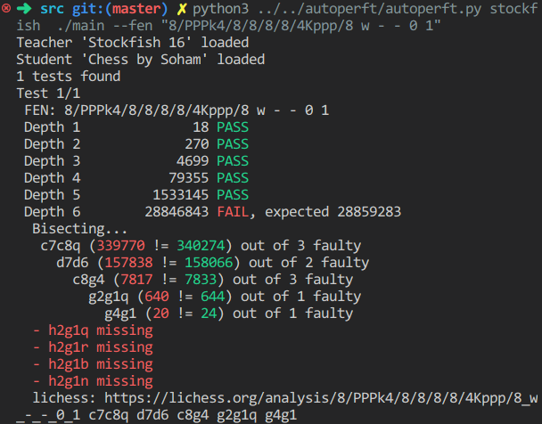

# autoperft
**Automatic perft checker for UCI chess engines**

[Perft](https://www.chessprogramming.org/Perft) (Performance Test) is a function that measures the number of possible legal moves from a given position to a certain depth. It is a crucial test for chess engines to verify the correctness of their move generation.

Using a Teacher-Student model, AutoPerft employs a strong reference engine (teacher) to verify the moves generated by a weaker engine (student) for a given set of positions. This approach reduces the time taken to pinpoint bugs by bisecting the moves where the engines differ, highlighting missing and extra moves generated by the student engine.



## Requirements
- Python 3.x
- UCI-compatible chess engines (see [Stockfish](https://stockfishchess.org/))
- FEN string or EPD file for test positions (see [perftsuite.epd](perftsuite.epd))

## Usage
To use AutoPerft, run the script with the appropriate arguments from your command line.

### Command-Line Arguments
- `teacher_path`: Path to the teacher engine executable.
- `student_path`: Path to the student engine executable.
- `--fen` or `--epd`: Provide either a single FEN string or a path to an EPD file.
- `--max_depth`: (Optional) Maximum depth for the perft test (default is 6).

### Example Commands
Using FEN:
```bash
python3 autoperft.py stockfish ./main --fen "8/PPPk4/8/8/8/8/4Kppp/8 w - - 0 1" --max_depth 6
```
Using EPD:
```bash
python3 autoperft.py path/to/teacher/engine path/to/student/engine --epd path/to/epd/file.epd --max_depth 6
```

## Customization
You can customize output parsing for specific engines by modifying the `customize` function. This function is called after loading the engines and allows you to set specific commands or regular expressions.

## Example customization:

```python
def customize(teacher, student):
    if student.get_name() == "Chess by Soham":
        student.PERFT_CMD = "perft {depth}"
        student.NODE_COUNT_REGEX = r"Nodes: (\d+)"
```

## Output

- Whether the perft results match between the teacher and student engines.
- If there is a mismatch, it bisects and highlights the specific moves causing the difference.
- Provides a link to Lichess for visual analysis of the position.
- Exits with a non-zero status code if any test fails.

## Useful Links

- https://www.chessprogramming.org/Perft
- https://www.chessprogramming.org/UCI
- https://lichess.org/analysis
- https://github.com/official-stockfish/Stockfish
- https://scidvspc.sourceforge.net/doc/EPD.htm

## Note

I wrote this script to help me debug my [chess engine](https://github.com/sohamkorade/chess_engine).